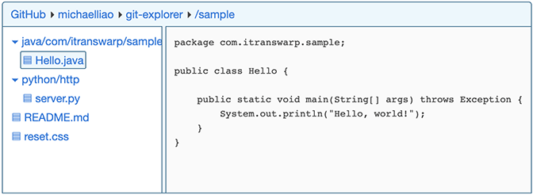

# Git Explorer

Git Explorer is a lightweight JavaScript library that transforms GitHub and Gitee repository URLs into interactive file explorers embedded directly within web pages.

For example, the link:

[https://github.com/michaelliao/git-explorer/tree/main/sample](https://github.com/michaelliao/git-explorer/tree/main/sample)

can be converted to:



See live demo on [https://michaelliao.github.io/git-explorer/](https://michaelliao.github.io/git-explorer/).

# Usage

```
<html>
<head>
    <link rel="stylesheet" href="https://michaelliao.github.io/git-explorer/css/git-explorer.css">
    <script src="https://michaelliao.github.io/git-explorer/js/git-explorer.js"></script>
</head>
<body>
    <div id="placeholder"></div>
    <script>
        createGitExplorer(
            document.querySelector('#placeholder'), // DOM to replace
            'https://github.com/michaelliao/git-explorer/tree/main/sample' // GitHub-compatible URL
        );
    </script>
</body>
</html>
```

### How to change style

Override [git-explorer.css](https://github.com/michaelliao/git-explorer/blob/main/css/git-explorer.css) in your own CSS.

# Notes

The URL must contain branch info otherwise the URL like this is not work:

```
https://github.com/michaelliao/git-explorer
```

Always use URL with branch:

```
https://github.com/michaelliao/git-explorer/tree/main
```
